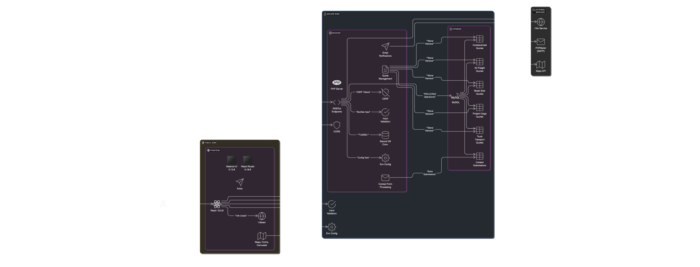

# Amanullah Transport & Logistics Website

A comprehensive shipping and logistics management system with a modern React frontend and PHP backend.

## Live Website
- Production URL: [https://amanullahgroup.ae/home](https://amanullahgroup.ae/home)

## System Architecture

The system follows a modern three-tier architecture with secure integrations and external services



### Architecture Components:

1. **Frontend Layer (React)**
   - User Interface Components
   - Form Management
   - Maps Integration
   - i18n Translation System

2. **Backend Layer (PHP)**
   - RESTful API Endpoints
   - Business Logic Processing
   - Security Middleware
   - Email Service Integration

3. **Database Layer**
   - MySQL Database
   - Secure PDO Connections
   - Quote Management Tables
   - Contact Management

4. **External Services**
   - Email Service (SMTP)
   - Maps API Integration
   - Translation Services

### Security Measures
- CORS Protection
- Input Validation
- Secure Database Connections
- Environment Configuration

## Features

### 1. Shipping Quote Management
- Multiple shipping types supported:
  - Containerized Shipping (FCL/LCL)
  - Air Freight
  - Break Bulk
  - Project Cargo & Heavy Lift
  - Truck Transportation

### 2. Frontend Features (React)
- Modern Material-UI based interface
- Responsive design for all devices
- Multi-language support (i18n integration)
- Interactive shipping quote forms
- Real-time form validation
- Dynamic route management
- Interactive maps for shipping routes
- Slick carousel for testimonials/features
- Custom animations and transitions

### 3. Backend Features (PHP)
- Secure database operations with PDO
- Email notifications system using PHPMailer
  - Customer confirmation emails
  - Internal team notifications
- Quote management system
- Contact form processing
- Database connection management
- CORS support for secure API communication

### 4. Security Features
- CSRF protection
- Secure email configuration
- Input validation and sanitization
- Environment-based configuration
- Secure database connections

### 5. Additional Features
- Interactive UI components
- Form validation
- Error handling
- Loading states
- Success notifications
- Responsive design
- SEO optimization

## Tech Stack

### Frontend
- React
- Material-UI
- React Router
- i18next
- Axios
- Various UI libraries (react-slick, react-simple-maps)

### Backend
- PHP
- MySQL Database
- PHPMailer
- PDO

## Setup Instructions

### Frontend Setup
1. Navigate to the `shippingFrontend` directory
2. Install dependencies:
   ```bash
   npm install
   ```
3. Start the development server:
   ```bash
   npm start
   ```

### Backend Setup
1. Navigate to the `shippingBackend` directory
2. Configure your database connection in `db_connect.php`
3. Install PHP dependencies:
   ```bash
   composer install
   ```
4. Configure your email settings in the quote handler files

### Database Configuration
1. Create a MySQL database named `logistics_db`
2. Import the database schema (contact administrator for schema)
3. Update the database credentials in `db_connect.php`

## Environment Variables
- Frontend: Configure API endpoints in `configUrl.js`
- Backend: Update database and email credentials in respective files
